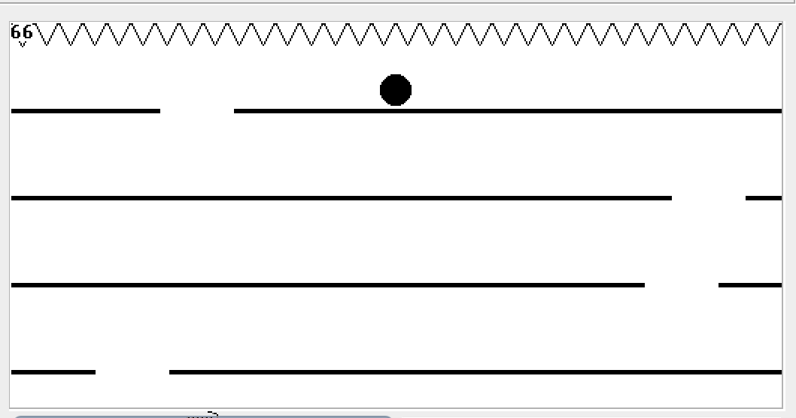
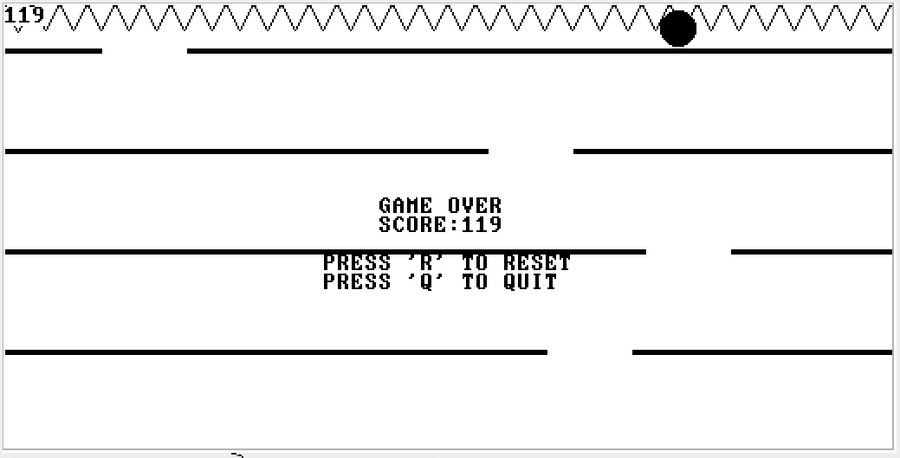

# Spike Runner
A small game written in the Jack programming language for NAND2TETRIS Part 2, Project 9.

## How to Play
Use the arrow keys to move the ball left and right. Try to reach the hole in the floor before the ball hits the top of the screen. 

## How to run
Compile all Jack code into .vm files using the Jack Compiler, then load into the VM Emulator located at https://nand2tetris.github.io/web-ide/vm.

## Screenshots of running game:

